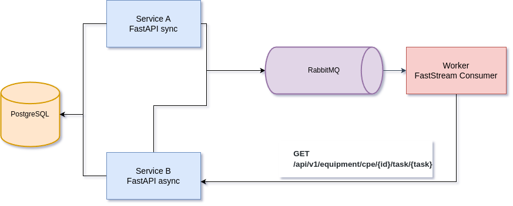

# DeviceTasker

Сервис обработки задач и активации оборудования, взаимодействующий с брокером сообщений

## 🛠️ Технологии

- **Python 3.12+** для разработки.
- **FastAPI** для создания REST API.
- **Postgres** для хранения и анализа данных.
- **RabittMQ** в качестве брокера сообщений
- **httpx** для асинхронных HTTP-запросов.
- **punq** для внедрения зависимостей.
- **docker-compose** для контейнеризации.
- **Makefile** для управления сборкой и запуском.

## ⚙️ Установка

Для установки и запуска проекта выполните следующие шаги:

1. Клонируйте репозиторий:
    ```bash
    git clone https://github.com/namig41/DeviceTasker.git
    cd DeviceTasker
    ```

2. Создайте и активируйте виртуальное окружение:
    ```bash
    python3 -m venv venv
    source venv/bin/activate  # Для Linux/MacOS
    venv\Scripts\activate  # Для Windows
    ```

3. Установите зависимости:
    ```bash
    pip install -r requirements.txt
    ```

4. Настройте файл конфигурации `.env`:
    ```bash
    cp .env.example .env
    ```

5. **Сборка и запуск через uv**:

    Установите `uv`:

    ```bash
    pip install uv
    ```
    Установите зависимости:

    ```bash
    uv sync
    ```

6. **Сборка и запуск через Docker**:
    Проект использует `Makefile` для автоматизации сборки и запуска через Docker.

    Для сборки и запуска используйте следующие команды:

    - Для сборки Docker-образа:
      ```bash
      make all
      ```

    - Для остановки контейнеров:
      ```bash
      make stop
      ```

    - Для очистка контейнеров:
      ```bash
      make clean
      ```

## 🧪 Тестирование

Проект включает в себя юнит-тесты и интеграционные тесты. Для их выполнения используйте команду:

```bash
make tests
```

## Architecture


